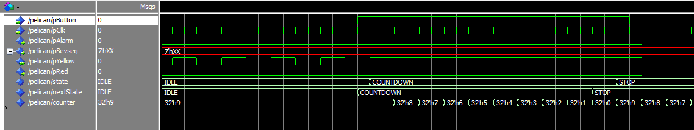

# Pelican Cross
Pedestrian Light Controlled Crossing.


## About
- Using Finite State Machine Concept
- Written in VHDL

## Simulation

### FSM State
#### Light
```bash
	type LightState is (IDLE, STOP, COUNTDOWN);
	signal state 		: LightState := IDLE;
	signal nextState 	: LightState := IDLE;
```
#### Timer
```bash
	type state_type is  (idle, high_pulse, low_pulse);
	-- idle, kondisi ketika timer tidak bekerja sehingga tidak menghitung jumlah clock pulse
	-- high_pulse, kondisi signal timer di trigger high degan duty cycle 5%
	-- low_pulse, kondisi menunggu selama 1 detik untuk trigger high yang selanjutnya
```

## Developer
- Almamater : Universitas Indonesia
- Major : Computer Engineering
### Arief Saferman
- NPM: 1806148656
### Farhan Almasyhur
- NPM: 1806200375
### Muhammad Alfi Aldolio
- NPM: 1806200015
### Ramadhan Kalih Sewu
- NPM: 1806148826
